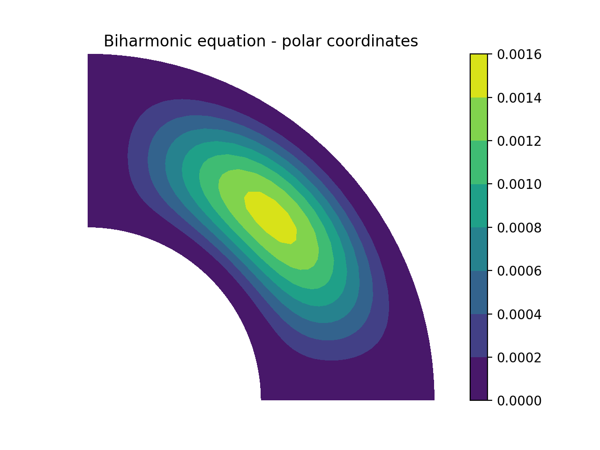
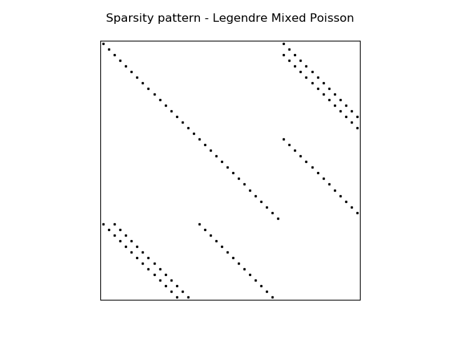
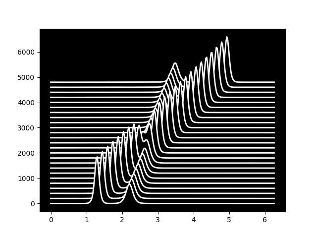
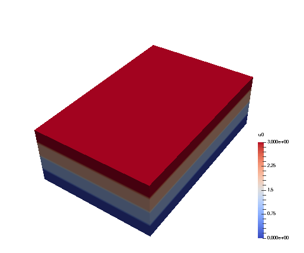
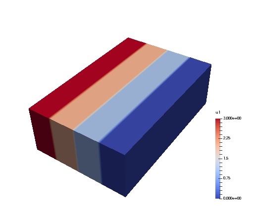
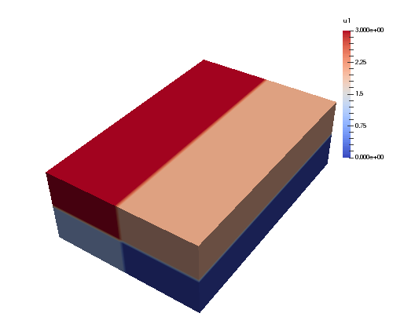

.. _sec:gettingstarted:

Getting started
===============

Basic usage
-----------

Shenfun consists of classes and functions whoose purpose it is to make it easier
to implement PDE's with spectral methods in simple tensor product domains. The
most important everyday tools are

	* :class:`.TensorProductSpace`
	* :class:`.CompositeSpace`
	* :class:`.TrialFunction`
	* :class:`.TestFunction`
	* :class:`.Function`
	* :class:`.Array`
	* :func:`.inner`
	* :func:`.div`
	* :func:`.grad`
	* :func:`.project`
	* :func:`.FunctionSpace`

A good place to get started is by creating a :func:`.FunctionSpace`. There are eight families of
function spaces: Fourier, Chebyshev (first and second kind), Legendre, Laguerre, Hermite, Ultraspherical
and Jacobi.
All spaces are defined on a one-dimensional reference
domain, with their own basis functions and quadrature points. For example, we have
the regular orthogonal Chebyshev space :math:`\text{span}\{T_k\}_{k=0}^{N-1}`, where :math:`T_k` is the
:math:`k`'th Chebyshev polynomial of the first kind. To create such a function space with
8 quadrature points do::

    from shenfun import FunctionSpace
    N = 8
    T = FunctionSpace(N, 'Chebyshev', bc=None)

Here ``bc=None`` is used to indicate that there are no boundary conditions associated
with this space, which is the default, so it could just as well have been left out.
To create
a regular orthogonal Legendre function space (i.e., :math:`\text{span}\{L_k\}_{k=0}^{N-1}`,
where :math:`L_k` is the :math:`k`'th Legendre polynomial), just replace
``Chebyshev`` with ``Legendre`` above. And to create a Fourier function space, just use
``Fourier``.

The function space :math:`T = \text{span}\{T_k\}_{k=0}^{N-1}` has many useful methods associated
with it, and we may experiment a little. A :class:`.Function` ``u`` using the basis in
:math:`T` has expansion

.. math::
   :label: eq:sum8

    u(x) = \sum_{k=0}^{N} \hat{u}_k T_k(x)

and an instance of this function (initialized with :math:`\hat{u}_k=0, \, k = 0, 1, \ldots, N`)
is created in shenfun as::

    from shenfun import Function
    u = Function(T)

Consider now for example the polynomial :math:`u_e(x)=2x^2-1`, which happens to be
exactly equal to :math:`T_2(x)`. We
can create this polynomial using `sympy <www.sympy.org>`_ ::

    import sympy as sp
    x = sp.Symbol('x')
    ue = 2*x**2 - 1  # or simply ue = sp.chebyshevt(2, x)

The Sympy function ``ue`` can now be evaluated on the quadrature points of basis
:math:`T`::

    from shenfun import Array
    xj = T.mesh()
    ua = Array(T)
    ua[:] = [ue.subs(x, xx) for xx in xj]
    print(xj)
      [ 0.98078528  0.83146961  0.55557023  0.19509032 -0.19509032 -0.55557023
       -0.83146961 -0.98078528]
    print(ua)
      [ 0.92387953  0.38268343 -0.38268343 -0.92387953 -0.92387953 -0.38268343
        0.38268343  0.92387953]

We see that ``ua`` is an :class:`.Array` on the function space ``T``, and not a
:class:`.Function`. The :class:`.Array` and :class:`Function` classes
are both subclasses of Numpy's `ndarray <https://docs.scipy.org/doc/numpy-1.14.0/reference/generated/numpy.ndarray.html>`_,
and represent the two arrays associated
with a spectral Galerkin function, like :eq:`eq:sum8`.
The :class:`.Function` represents the entire spectral Galerkin function, with
array values corresponding to the sequence of expansion coefficients
:math:`\boldsymbol{\hat{u}}=\{\hat{u}_k\}_{k=0}^{7}`.
The :class:`.Array` represents the spectral Galerkin function evaluated
on the quadrature mesh of the function space ``T``, which here is
equal to :math:`\{u_e(x_i)\}_{i=0}^7`.

We now want to find the :class:`.Function` ``uh`` corresponding to
:class:`.Array` ``ua``. Considering :eq:`eq:sum8`, this corresponds to finding
:math:`\boldsymbol{\hat{u}}` if the left hand side :math:`u(x_j)` is known for
all quadrature points :math:`x_j`.

Since we already know that ``ue(x)`` is
equal to the second Chebyshev polynomial, we should get an array of
expansion coefficients equal to :math:`\boldsymbol{\hat{u}} = (0, 0, 1, 0, 0, 0, 0, 0)`.
We can compute ``uh`` either by using :func:`.project` or a forward transform::

    from shenfun import project
    uh = Function(T)
    uh = T.forward(ue, uh)
    # or
    # uh = ue.forward(uh)
    # or
    # uh = project(ue, T)
    print(uh)
      [-1.38777878e-17  6.72002101e-17  1.00000000e+00 -1.95146303e-16
        1.96261557e-17  1.15426347e-16 -1.11022302e-16  1.65163507e-16]

So we see that the projection works to machine precision.

The projection is mathematically: find :math:`u_h \in T`, such that

.. math::

    (u_h - u_e, v)_w = 0 \quad \forall v \in T,

where :math:`v` is a test function, :math:`u_h` is a trial function and the
notation :math:`(\cdot, \cdot)_w` was introduced in :eq:`eq:wrm_test`. Using
now :math:`v=T_k` and :math:`u_h=\sum_{j=0}^7 \hat{u}_j T_j`, we get

.. math::

    (\sum_{j=0}^7 \hat{u}_j T_j, T_k)_w &= (u_e, T_k)_w, \\
    \sum_{j=0}^7 (T_j, T_k)_w \hat{u}_j &= (u_e, T_k)_w,

for :math:`k = 0, 1, \ldots, 7`. This can be rewritten on matrix form as

.. math::

    b_{kj} \hat{u}_j = \tilde{u}_k,

where :math:`b_{kj} = (T_j, T_k)_w`, :math:`\tilde{u}_k = (u_e, T_k)_w` and
summation is implied by the repeating :math:`j` indices. Since the
Chebyshev polynomials are orthogonal the mass matrix :math:`B=(b_{kj}) \in \mathbb{R}^{N \times N}`
is diagonal. We can assemble both the matrix :math:`B` and the vector
:math:`\boldsymbol{\tilde{u}}=(\tilde{u}_j) \in \mathbb{R}^N` with shenfun, and at the
same time introduce the :class:`.TestFunction`, :class:`.TrialFunction` classes
and the :func:`.inner` function::

    from shenfun import TestFunction, TrialFunction, inner
    u = TrialFunction(T)
    v = TestFunction(T)
    B = inner(u, v)
    u_tilde = inner(ue, v)
    dict(B)
      {0: array([3.14159265, 1.57079633, 1.57079633, 1.57079633, 1.57079633,
       1.57079633, 1.57079633, 1.57079633])}
    print(u_tilde)
      [-4.35983562e-17  1.05557843e-16  1.57079633e+00 -3.06535096e-16
        3.08286933e-17  1.81311282e-16 -1.74393425e-16  2.59438230e-16]

The :func:`.inner` function represents the (weighted) inner product and it expects
one test function, and possibly one trial function. If, as here, it also
contains a trial function, then a matrix is returned. If :func:`.inner`
contains one test, but no trial function, then an array is returned.
Finally, if :func:`.inner` contains no test nor trial function, but instead
a number and an :class:`.Array`, like::

    a = Array(T, val=1)
    print(inner(1, a))
      2.0

then :func:`.inner` represents a non-weighted integral over the domain.
Here it returns the length of the domain (2.0) since `a` is initialized
to unity.

Note that the matrix :math:`B` assembled above is stored using shenfun's
:class:`.SpectralMatrix` class, which is a subclass of Python's dictionary,
where the keys are the diagonals and the values are the diagonal entries.
The matrix :math:`B` is seen to have only one diagonal (the principal)
:math:`(b_{ii})_{i=0}^{7}`.

With the matrix comes a `solve` method and we can solve for :math:`\hat{u}`
through::

    u_hat = Function(T)
    u_hat = B.solve(u_tilde, u=u_hat)
    print(u_hat)
      [-1.38777878e-17  6.72002101e-17  1.00000000e+00 -1.95146303e-16
        1.96261557e-17  1.15426347e-16 -1.11022302e-16  1.65163507e-16]

which obviously is exactly the same as we found using :func:`.project`
or the `T.forward` function.

Note that :class:`.Array` merely is a subclass of Numpy's ``ndarray``,
whereas :class:`.Function` is a subclass
of both Numpy's ``ndarray`` *and* the :class:`.BasisFunction` class. The
latter is used as a base class for arguments to bilinear and linear forms,
and is as such a base class also for :class:`.TrialFunction` and
:class:`.TestFunction`. An instance of the :class:`.Array` class cannot
be used in forms, except from regular inner products of numbers or
test function vs an :class:`.Array`. To illustrate, lets create some forms,
where all except the last one is ok::

    from shenfun import Dx
    T = FunctionSpace(12, 'Legendre')
    u = TrialFunction(T)
    v = TestFunction(T)
    uf = Function(T)
    ua = Array(T)
    A = inner(v, u)   # Mass matrix
    c = inner(v, ua)  # ok, a scalar product
    d = inner(v, uf)  # ok, a scalar product (slower than above)
    e = inner(1, ua)  # ok, non-weighted integral of ua over domain
    df = Dx(uf, 0, 1) # ok
    da = Dx(ua, 0, 1) # Not ok

        AssertionError                            Traceback (most recent call last)
        <ipython-input-14-3b957937279f> in <module>
        ----> 1 da = inner(v, Dx(ua, 0, 1))

        ~/MySoftware/shenfun/shenfun/forms/operators.py in Dx(test, x, k)
             82         Number of derivatives
             83     """
        ---> 84     assert isinstance(test, (Expr, BasisFunction))
             85
             86     if isinstance(test, BasisFunction):

        AssertionError:

So it is not possible to perform operations that involve differentiation
(`Dx` represents a partial derivative) on an
:class:`.Array` instance. This is because the ``ua`` does not contain more
information than its values and its TensorProductSpace. A :class:`.BasisFunction`
instance, on the other hand, can be manipulated with operators like :func:`.div`
:func:`.grad` in creating instances of the :class:`.Expr` class, see
:ref:`operators`.

Note that any rules for efficient use of Numpy ``ndarrays``, like vectorization,
also applies to :class:`.Function` and :class:`.Array` instances.

.. _operators:

Operators
---------

Operators act on any single instance of a :class:`.BasisFunction`, which can
be :class:`.Function`, :class:`.TrialFunction` or :class:`.TestFunction`. The
implemented operators are:

	* :func:`.div`
	* :func:`.grad`
	* :func:`.curl`
	* :func:`.Dx`

Operators are used in variational forms assembled using :func:`.inner`
or :func:`.project`, like::

    A = inner(grad(u), grad(v))

which assembles a stiffness matrix A. Note that the two expressions fed to
inner must have consistent rank. Here, for example, both ``grad(u)`` and
``grad(v)`` have rank 1 of a vector.

Boundary conditions
-------------------

The :func:`.FunctionSpace` has a keyword `bc` that can be used to specify
boundary conditions. This keyword can take several different inputs. The
default is ``None``, which will return an orthogonal space with no boundary
condition associated. This means for example a pure orthogonal Chebyshev
or Legendre series, if these are the families. Otherwise, a Dirichlet space
can be chosen using either one of::

    bc = (a, b)
    bc = {'left': {'D': a}, 'right': {'D': b}}
    bc = f"u(-1)={a} && u(1)={b}"

This sets a Dirichlet boundary condition on both left and right hand side
of the domain, with ``a`` and ``b`` being the values. The third option uses the
location of the boundary, so here the domain is the standard reference domain
(-1, 1). Similarly, a pure Neumann space may be chosen using either::

    bc = {'left': {'N': a}, 'right': {'N': b}}
    bc = f"u'(-1)={a} && u'(1)={b}"

Using either one of::

    bc = (None, b)
    bc = {'right': {'D': b}}
    bc = f"u(1)={b}"

returns a space with only one Dirichlet boundary condition, on the right
hand side of the domain. For one Dirichlet boundary condition on the
left instead use ``bc = (a, None)``, ``bc = {'left': {'D': a}}`` or
``bc = f"u(-1)={a}"``.

Using either one of::

    bc = (a, b, c, d)
    bc = {'left': {'D': a, 'N': b}}, 'right': {'D': c, 'N': d}}
    bc = f"u({-1})={a} && u'(-1)={b} && u(1)={c} && u'(1)={d}"

returns a space with 4 boundary conditions (biharmonic), where ``a`` and ``b``
are the Dirichlet and Neumann values on the left boundary, whereas ``c`` and ``d``
are the values on right.

The Laguerre basis is used to solve problems on the half-line :math:`x \in [0, \infty]`.
For this family you can only specify boundary conditions at the
left boundary. However, the Poisson equation requires only one condition,
and the biharmonic problem two. The solution is automatically set to
zero at :math:`x \rightarrow \infty`.

Any kind of boundary condition may be specified. For higher order
derivatives, use the form ``bc = f"u''(-1)={a}"``, or ``bc = {'left': {'N2': a}}``,
and similar for higher order.

Multidimensional problems
-------------------------

As described in the introduction, a multidimensional problem is handled using
tensor product spaces, that have basis functions generated from taking the
outer products of one-dimensional basis functions. We
create tensor product spaces using the class :class:`.TensorProductSpace`::

    N, M = (12, 16)
    C0 = FunctionSpace(N+2, 'L', bc=(0, 0), scaled=True)
    K0 = FunctionSpace(M, 'F', dtype='d')
    T = TensorProductSpace(comm, (C0, K0))

Associated with this is a Cartesian mesh :math:`[-1, 1] \times [0, 2\pi]`. We use
classes :class:`.Function`, :class:`.TrialFunction` and :class:`.TestFunction`
exactly as before::

    u = TrialFunction(T)
    v = TestFunction(T)
    A = inner(grad(u), grad(v))

However, now ``A`` will be a tensor product matrix, or more correctly,
the sum of two tensor product matrices. This can be seen if we look at
the equations beyond the code. In this case we are using a composite
Legendre basis for the first direction and Fourier exponentials for
the second, and the tensor product basis function is

.. math::

    v_{kl}(x, y) &= \frac{1}{\sqrt{4k+6}}(L_k(x) - L_{k+2}(x)) \exp(\imath l y), \\
                 &= \psi_k(x) \exp(\imath l y),

where :math:`\imath=\sqrt{-1}`, :math:`L_k` is the :math:`k`'th Legendre polynomial and
:math:`\psi_k = (L_k-L_{k+2})/\sqrt{4k+6}` is used
for simplicity in later expressions. The trial function is now

.. math::

    u(u, y) = \sum_{k=0}^{N-1} \sum_{l=-M/2}^{M/2-1} \hat{u}_{kl} \psi_k(x) \exp(\imath l y)

where the sum on the Fourier exponentials will be implemented to take advantage of
the Hermitian symmetry of the real input data. That is, :math:`\hat{u}_{k,l} = \overline{\hat{u}}_{k,-l}`,
where the overline represents a complex conjugate. Note that because of this symmetry the
shape of the stored array :math:`(\hat{u}_{kl})` will be :math:`N \times M/2+1`.

The inner product (``inner(grad(u), grad(v))``) is now computed as

.. math::
    :label: eq:poissons

    (\nabla u, \nabla v)_w &= \int_{-1}^{1} \int_{0}^{2 \pi} \nabla u \cdot \nabla \overline{v} \omega dxdy, \\
                           &= \frac{1}{2\pi} \int_{-1}^{1} \int_{0}^{2 \pi} \left(\frac{\partial u}{\partial x} \frac{\partial \overline{v}}{\partial x} + \frac{\partial u}{\partial y}\frac{\partial \overline{v}}{\partial y}\right) dxdy, \\
                           &= \frac{1}{2\pi} \int_{-1}^{1} \int_{0}^{2 \pi} \frac{\partial u}{\partial x} \frac{\partial \overline{v}}{\partial x} dxdy + \frac{1}{2\pi} \int_{-1}^{1} \int_{0}^{2 \pi} \frac{\partial u}{\partial y} \frac{\partial \overline{v}}{\partial y} dxdy,

where :math:`\overline{v}` is the complex conjugate of :math:`v` and we use the weight
:math:`\omega = 1/2\pi`. We see that the inner product is really the sum of two tensor
product matrices. However, each one of these also contains the outer product of
smaller matrices. To see this we need to insert for the
trial and test functions (using :math:`v_{mn}` for test):

.. math::
    \frac{1}{2\pi}\int_{-1}^{1} &\int_{0}^{2 \pi} \frac{\partial u}{\partial x} \frac{\partial \overline{v}}{\partial x} dxdy \\
    &= \frac{1}{2\pi}\int_{-1}^{1} \int_{0}^{2 \pi} \frac{\partial}{\partial x} \left( \sum_{k=0}^{N-1} \sum_{l=0}^{M/2} \hat{u}_{kl} \psi_k \exp(\imath l y)  \right) \frac{\partial}{\partial x} \left(\psi_m \exp(- \imath n y)\right) dxdy, \\
    &= \sum_{k=0}^{N-1} \sum_{l=-M/2}^{M/2-1} \underbrace{ \int_{-1}^{1}  \frac{\partial \psi_k}{\partial x} \frac{\partial \psi_m}{\partial x} dx}_{a_{mk}} \underbrace{ \frac{1}{2\pi}\int_{0}^{2 \pi} \exp(\imath l y) \exp(-\imath n y) dy }_{b_{nl}} \, \hat{u}_{kl},

where :math:`A = (a_{mk}) \in \mathbb{R}^{N \times N}` and :math:`B = (b_{nl}) \in \mathbb{R}^{(M/2+1)\times (M/2+1)}`,
again using the Hermitian symmetry to reduce the shape of the Fourier axis to :math:`M/2+1`.
The tensor product matrix :math:`a_{mk} b_{nl}` (or in matrix notation :math:`A \otimes B`)
is the first item of the two
items in the list that is returned by ``inner(grad(u), grad(v))``. The other
item is of course the second term in the last line of :eq:`eq:poissons`:

.. math::
     \frac{1}{2\pi} \int_{-1}^{1} &\int_{0}^{2 \pi} \frac{\partial u}{\partial y} \frac{\partial \overline{v}}{\partial y} dxdy \\
     &= \frac{1}{2\pi}\int_{-1}^{1} \int_{0}^{2 \pi} \frac{\partial}{\partial y} \left( \sum_{k=0}^{N-1} \sum_{l=0}^{M/2} \hat{u}_{kl} \psi_k \exp(\imath l y) \right) \frac{\partial}{\partial y} \left(\psi_m \exp(- \imath n y) \right) dxdy \\
     &= \sum_{k=0}^{N-1} \sum_{l=-M/2}^{M/2-1} \underbrace{ \int_{-1}^{1}  \psi_k \psi_m dx}_{c_{mk}} \underbrace{\frac{1}{2\pi} \int_{0}^{2 \pi} \frac{\partial \exp(\imath l y)}{\partial y} \frac{ \partial  \exp(- \imath n y) }{\partial y} dy}_{d_{nl}} \, \hat{u}_{kl}

The tensor product matrices :math:`a_{mk} b_{nl}` and :math:`c_{mk}d_{nl}` are both instances
of the :class:`.TPMatrix` class. Together they lead to linear algebra systems
like:

.. math::
    :label: eq:multisystem

    (a_{mk}b_{nl} + c_{mk}d_{nl}) \hat{u}_{kl} = \tilde{f}_{mn},

where :math:`0 \le m < N, 0 \le n \le M/2` and
:math:`\tilde{f}_{mn} = (v_{mn}, f)_w` for some right hand side :math:`f`,
see, e.g., :eq:`eq:poissonmulti`. Note that an alternative formulation here is

.. math::

    A U B^T + C U D^T = F,

where :math:`U=(\hat{u}_{kl}) \in \mathbb{R}^{N \times M/2+1}` and
:math:`F = (\tilde{f}_{kl}) \in \mathbb{R}^{N \times M/2+1}` are treated as regular matrices.
This formulation is utilized to derive efficient solvers for tensor product bases
in multiple dimensions using the matrix decomposition
method in :cite:`shen1` and :cite:`shen95`. In shenfun we have generic solvers
for such multi-dimensional problems that make use of Kronecker product
matrices and the ``vec`` `operation <https://en.wikipedia.org/wiki/Kronecker_product#Matrix_equations>`_.
We have

.. math::

    \text{vec}(A U B^T) + \text{vec}(C U D^T) &= \text{vec}(F), \\
    (A \otimes B + C \otimes D ) \text{vec}(U) &= \text{vec}(F)

where :math:`\text{vec}(U) = (\hat{u}_{0,0}, \ldots, \hat{u}_{0,M/2}, \hat{u}_{1,0}, \ldots \hat{u}_{1,M/2}, \ldots, \ldots, \hat{u}_{N-1,0}, \ldots, \hat{u}_{N-1,M/2})^T`
is a vector obtained by flattening the row-major matrix :math:`U`. The generic Kronecker solvers
are found in :class:`.Solver2D` and :class:`.Solver3D` for two- and three-dimensional
problems.

Note that in our case the equation system :eq:`eq:multisystem` can be greatly simplified since
three of the submatrices (:math:`A, B` and :math:`D`) are diagonal.
Even more, two of them equal the identity matrix

.. math::

    a_{mk} &= \delta_{mk}, \\
    b_{nl} &= \delta_{nl},

whereas the last one can be written in terms of the identity
(no summation on repeating indices)

.. math::

    d_{nl} = l^2\delta_{nl}.

Inserting for this in :eq:`eq:multisystem` and simplifying by requiring that
:math:`l=n` in the second step, we get

.. math::
    :label: eq:matfourier

    (\delta_{mk}\delta_{nl} + l^2 c_{mk}\delta_{nl}) \hat{u}_{kl} &= \tilde{f}_{mn}, \\
    (\delta_{mk} + l^2 c_{mk}) \hat{u}_{kl} &= \tilde{f}_{ml}.

Now if we keep :math:`l` fixed this latter equation is simply a regular
linear algebra problem to solve for :math:`\hat{u}_{kl}`, for all :math:`k`.
Of course, this solve needs to be carried out for all :math:`l`.

Note that there is a generic solver :class:`.SolverGeneric1ND` available for
problems like :eq:`eq:multisystem`, that have one Fourier space and one
non-periodic space. Another possible solver is :class:`.Solver2D`, which
makes no assumptions of diagonality and solves the problem using a
Kronecker product matrix. Assuming there is a right hand side function
`f`, the solver is created and used as::

    from shenfun import la
    solver = la.SolverGeneric1ND(A)
    u_hat = Function(T)
    f_tilde = inner(v, f)
    u_hat = solver(f_tilde, u_hat)

For multidimensional problems it is possible to use a boundary condition
that is a function of the computational coordinates. For
example::

    import sympy as sp
    x, y = sp.symbols('x,y', real=True)
    B0 = FunctionSpace(N, 'C', bc=((1-y)*(1+y), 0), domain=(-1, 1))
    B1 = FunctionSpace(N, 'C', bc=(0, (1-x)*(1+x)), domain=(-1, 1))
    T = TensorProductSpace(comm, (B0, B1))

uses homogeneous Dirichlet on two out of the four sides of the
square domain :math:`(-1, 1)\times (-1, 1)`, at :math:`x=-1`
and :math:`y=1`. For the side where
:math:`y=1`, the
boundary condition is :math:`(1-x)(1+x)`. Note that only
:math:`x` will vary along the side where :math:`y=1`, which is
the right hand side of the domain for `B1`. Also note that the
boundary condition on the square domain should match in the
corners, or else there will be severe Gibbs oscillations in
the solution. The problem with two non-periodic directions
can use the solvers :class:`.Solver2D` or :class:`.SolverGeneric2ND`,
where the latter can also take one Fourier direction in a 3D
problem.

Curvilinear coordinates
-----------------------
Shenfun can be used to solve equations using curvilinear
coordinates, like polar, cylindrical
and spherical coordinates. The feature was added April 2020, and is still rather
experimental. The curvilinear coordinates are defined by the user, who
needs to provide a map, i.e., the position vector, between new coordinates and
the Cartesian coordinates. The basis functions of the new coordinates need not
be orthogonal, but non-orthogonal is not widely tested so use with care.
In shenfun we use non-normalized natural (covariant) basis vectors. For this
reason the equations may look a little bit different than usual. For example,
in cylindrical coordinates we have the position vector

.. math::
    :label: eq:cylpositionvector

    \mathbf{r} = r \cos \theta \, \mathbf{i} + r \sin \theta \,\mathbf{j} + z \,\mathbf{k},

where :math:`\mathbf{i, j, k}` are the Cartesian unit vectors and :math:`r, \theta, z`
are the new coordinates. The covariant basis vectors are then

.. math::
    :label: eq:covbasis

    \mathbf{b}_r &= \frac{\partial \mathbf{r}}{ \partial r}, \\
    \mathbf{b}_{\theta} &= \frac{\partial \mathbf{r}}{ \partial \theta }, \\
    \mathbf{b}_z &= \frac{\partial \mathbf{r}}{ \partial z},

leading to

.. math::
    :label: eq:bbasis1

    \mathbf{b}_{r}&=\cos{\left(\theta \right)}\,\mathbf{i}+\sin{\left(\theta \right)}\,\mathbf{j}, \\ \mathbf{b}_{\theta}&=- r \sin{\left(\theta \right)}\,\mathbf{i}+r \cos{\left(\theta \right)}\,\mathbf{j}, \\ \mathbf{b}_{z}&=\mathbf{k}.

We see that :math:`|\mathbf{b}_{\theta}| = r` and not unity. In shenfun
you can choose to use covariant basis vectors, or the more common normalized
basis vectors, that are also called physical basis vectors. These are

.. math::
    :label: eq:bbasis2

    \mathbf{e}_{r}&=\cos{\left(\theta \right)}\,\mathbf{i}+\sin{\left(\theta \right)}\,\mathbf{j}, \\ \mathbf{e}_{\theta}&=- \sin{\left(\theta \right)}\,\mathbf{i}+\cos{\left(\theta \right)}\,\mathbf{j}, \\ \mathbf{e}_{z}&=\mathbf{k}.

To choose there is a configuration parameter called `basisvectors` in the configuration file
`shenfun.yaml` (see :ref:`Configuration`), that can be set to either `covariant` or `normal`.

A vector :math:`\mathbf{u}` in the covariant basis is given as

.. math::
    :label: eq:vecu

    \mathbf{u} = u^r \mathbf{b}_r + u^{\theta} \mathbf{b}_{\theta} + u^{z} \mathbf{b}_z,

and the vector Laplacian :math:`\nabla^2 \mathbf{u}` is

.. math::
    :label: eq:veclaplacian

    \left( \frac{\partial^2 u^{r}}{\partial^2r}+\frac{1}{r}\frac{\partial  u^{r}}{\partial r}+\frac{1}{r^{2}}\frac{\partial^2 u^{r}}{\partial^2\theta}- \frac{2}{r}\frac{\partial  u^{\theta}}{\partial \theta}- \frac{1}{r^{2}}u^{r}+\frac{\partial^2 u^{r}}{\partial^2z}\right) \mathbf{b}_{r} \\+\left( \frac{\partial^2 u^{\theta}}{\partial^2r}+\frac{3}{r}\frac{\partial  u^{\theta}}{\partial r}+\frac{2}{r^{3}}\frac{\partial  u^{r}}{\partial \theta}+\frac{1}{r^{2}}\frac{\partial^2 u^{\theta}}{\partial^2\theta}+\frac{\partial^2 u^{\theta}}{\partial^2z}\right) \mathbf{b}_{\theta} \\+\left( \frac{\partial^2 u^{z}}{\partial^2r}+\frac{1}{r}\frac{\partial  u^{z}}{\partial r}+\frac{1}{r^{2}}\frac{\partial^2 u^{z}}{\partial^2\theta}+\frac{\partial^2 u^{z}}{\partial^2z}\right) \mathbf{b}_{z}.

which is slightly different from what you see in most textbooks, which are using
the normalized basis vectors.

Note that once the curvilinear map has been created, shenfun's operators
:func:`.div`, :func:`.grad` and :func:`.curl` work out of the box with
no additional effort. So you do not have to implement messy equations
that look like :eq:`eq:veclaplacian` directly. Take the example with
cylindrical coordinates. The vector Laplacian can be implemented
as::

    from shenfun import *
    import sympy as sp

    r, theta, z = psi = sp.symbols('x,y,z', real=True, positive=True)
    rv = (r*sp.cos(theta), r*sp.sin(theta), z)

    N = 10
    F0 = FunctionSpace(N, 'F', dtype='d')
    F1 = FunctionSpace(N, 'F', dtype='D')
    L = FunctionSpace(N, 'L', domain=(0, 1))
    T = TensorProductSpace(comm, (L, F1, F0), coordinates=(psi, rv))
    V = VectorSpace(T)
    u = TrialFunction(V)
    du = div(grad(u))

There are curvilinear demos for solving both `Helmholtz's
equation <https://github.com/spectralDNS/shenfun/blob/master/demo/unitdisc_helmholtz.py>`_
and the `biharmonic equation <https://github.com/spectralDNS/shenfun/blob/master/demo/unitdisc_biharmonic.py>`_
on a circular disc, a solver for `3D Poisson equation in a pipe <https://github.com/spectralDNS/shenfun/blob/master/demo/pipe_poisson.py>`_,
and a solver for the `biharmonic equation on a part of the disc <https://github.com/spectralDNS/shenfun/blob/master/demo/unitdisc_biharmonic2NP.py>`_.
Also, the Helmholtz equation solved on the unit sphere using
spherical coordinates is shown `here <https://github.com/spectralDNS/shenfun/blob/master/demo/sphere_helmholtz.py>`_,
and on the torus `here <https://github.com/spectralDNS/shenfun/blob/master/binder/Torus.ipynb>`_.
A solution from solving the biharmonic equation with homogeneous
Dirichlet boundary conditions on :math:`(\theta, r) \in [0, \pi/2] \times [0.5, 1]`
is shown below.

Coupled problems
----------------

With Shenfun it is possible to solve equations coupled and implicit using the
:class:`.CompositeSpace` class for multidimensional problems and
:class:`.MixedFunctionSpace` for one-dimensional problems. As an example, lets consider
a mixed formulation of the Poisson equation. The Poisson equation is given as
always as

.. math::
    :label: eq:poissonmulti

    \nabla^2 u(\boldsymbol{x}) = f(\boldsymbol{x}), \quad \text{for} \quad \boldsymbol{x} \in \Omega,

but now we recast the problem into a mixed formulation

.. math::

    \sigma(\boldsymbol{x})- \nabla u (\boldsymbol{x})&= 0,  \quad \text{for} \quad \boldsymbol{x} \in \Omega, \\
    \nabla \cdot \sigma (\boldsymbol{x})&= f(\boldsymbol{x}), \quad \text{for} \quad \boldsymbol{x} \in \Omega.

where we solve for the vector :math:`\sigma` and scalar :math:`u` simultaneously. The
domain :math:`\Omega` is taken as a multidimensional Cartesian product
:math:`\Omega=[-1, 1] \times [0, 2\pi]`, but the code is more or less identical for
a 3D problem. For boundary conditions we use Dirichlet in the :math:`x`-direction and
periodicity in the :math:`y`-direction:

.. math::

    u(\pm 1, y) &= 0 \\
    u(x, 2\pi) &= u(x, 0)

Note that there is no boundary condition on :math:`\sigma`, only on :math:`u`.
For this reason we choose a Dirichlet basis :math:`SD` for :math:`u` and a regular
Legendre or Chebyshev :math:`ST` basis for :math:`\sigma`. With :math:`K0` representing
the function space in the periodic direction, we get the relevant 2D tensor product
spaces as :math:`TD = SD \otimes K0` and :math:`TT = ST \otimes K0`.
Since :math:`\sigma` is
a vector we use a :class:`.VectorSpace` :math:`VT = TT \times TT` and
finally a :class:`.CompositeSpace` :math:`Q = VT \times TD` for the coupled and
implicit treatment of :math:`(\sigma, u)`::

    from shenfun import VectorSpace, CompositeSpace
    N, M = (16, 24)
    family = 'Legendre'
    SD = FunctionSpace(N[0], family, bc=(0, 0))
    ST = FunctionSpace(N[0], family)
    K0 = FunctionSpace(N[1], 'Fourier', dtype='d')
    TD = TensorProductSpace(comm, (SD, K0), axes=(0, 1))
    TT = TensorProductSpace(comm, (ST, K0), axes=(0, 1))
    VT = VectorSpace(TT)
    Q = CompositeSpace([VT, TD])

In variational form the problem reads: find :math:`(\sigma, u) \in Q`
such that

.. math::
    :label: eq:coupled

    (\sigma, \tau)_w - (\nabla u, \tau)_w &= 0, \quad \forall \tau \in VT, \\
    (\nabla \cdot \sigma, v)_w  &= (f, v)_w \quad \forall v \in TD

To implement this we use code that is very similar to regular, uncoupled
problems. We create test and trialfunction::

    gu = TrialFunction(Q)
    tv = TestFunction(Q)
    sigma, u = gu
    tau, v = tv

and use these to assemble all blocks of the variational form :eq:`eq:coupled`::

    # Assemble equations
    A00 = inner(sigma, tau)
    if family.lower() == 'legendre':
        A01 = inner(u, div(tau))
    else:
        A01 = inner(-grad(u), tau)
    A10 = inner(div(sigma), v)

Note that we here can use integration by parts for Legendre, since the weight function
is a constant, and as such get the term :math:`(-\nabla u, \tau)_w = (u, \nabla \cdot \tau)_w`
(boundary term is zero due to homogeneous Dirichlet boundary conditions).

We collect all assembled terms in a :class:`.BlockMatrix`::

    from shenfun import BlockMatrix
    H = BlockMatrix(A00+A01+A10)

This block matrix ``H`` is then simply (for Legendre)

.. math::
    :label: eq:coupledH

    \begin{bmatrix}
        (\sigma, \tau)_w & (u, \nabla \cdot \tau)_w \\
        (\nabla \cdot \sigma, v)_w & 0
    \end{bmatrix}

Note that each item in :eq:`eq:coupledH` is a collection of instances of the
:class:`.TPMatrix` class, and for similar reasons as given around :eq:`eq:matfourier`,
we get also here one regular block matrix for each Fourier wavenumber.
The sparsity pattern is the same for all matrices except for wavenumber 0.
The (highly sparse) sparsity pattern for block matrix :math:`H` with
wavenumber :math:`\ne 0` is shown in the image below

A complete demo for the coupled problem discussed here can be found in
`MixedPoisson.py <https://github.com/spectralDNS/shenfun/blob/master/demo/MixedPoisson.py>`_
and a 3D version is in `MixedPoisson3D.py <https://github.com/spectralDNS/shenfun/blob/master/demo/MixedPoisson3D.py>`_.

Integrators
-----------

The :mod:`.integrators` module contains some interator classes that can be
used to integrate a solution forward in time. Integrators are set up to solve
initial value problems like

.. math::
    :label: eq:nlsolver

    \frac{\partial u}{\partial t} = L u + N(u)

where :math:`u` is the solution, :math:`L` is a linear operator and
:math:`N(u)` is the nonlinear part of the right hand side.

There are two kinds of integrators, or time steppers. The first are
ment to be subclassed and used one at the time. These are

    * :class:`.IRK3`: Third order implicit Runge-Kutta
    * :class:`.RK4`: Explicit Runge-Kutta fourth order (Fourier only)
    * :class:`.ETD`: Exponential time differencing Euler method (Fourier only)
    * :class:`.ETDRK4`: Exponential time differencing Runge-Kutta fourth order (Fourier only)

See, e.g.::

    H. Montanelli and N. Bootland "Solving periodic semilinear PDEs in 1D, 2D and
    3D with exponential integrators", https://arxiv.org/pdf/1604.08900.pdf

The second kind is ment to be used for systems of equations, one class
instance for each equation. These are mainly IMEX Runge Kutta integrators:

    * :class:`.IMEXRK3`
    * :class:`.IMEXRK111`
    * :class:`.IMEXRK222`
    * :class:`.IMEXRK443`

See, e.g., https://github.com/spectralDNS/shenfun/blob/master/demo/ChannelFlow.py
for an example of use for the Navier-Stokes equations. The IMEX solvers
are described by::

    Ascher, Ruuth and Spiteri 'Implicit-explicit Runge-Kutta methods for
    time-dependent partial differential equations' Applied Numerical
    Mathematics, 25 (1997) 151-167

Note that the IMEX solvers are intended for use with problems consisting of one
non-periodic direction.

To illustrate, we consider the time-dependent 1-dimensional Kortveeg-de Vries
equation

.. math::

    \frac{\partial u}{\partial t} + \frac{\partial ^3 u}{\partial x^3} + u \frac{\partial u}{\partial x} = 0

which can also be written as

.. math::

    \frac{\partial u}{\partial t} + \frac{\partial ^3 u}{\partial x^3} + \frac{1}{2}\frac{\partial u^2}{\partial x} = 0

We neglect boundary issues and choose a periodic domain :math:`[0, 2\pi]` with
Fourier exponentials as test functions. The initial condition is chosen as

.. math::
   :label: eq:init_kdv

    u(x, t=0) = 3 A^2/\cosh(0.5 A (x-\pi+2))^2 + 3B^2/\cosh(0.5B(x-\pi+1))^2

where :math:`A` and :math:`B` are constants. For discretization in space we use
the basis :math:`V_N = \text{span}\{exp(\imath k x)\}_{k=0}^N` and formulate the
variational problem: find :math:`u \in V_N` such that

.. math::

    \frac{\partial }{\partial t} \Big(u, v \Big) = -\Big(\frac{\partial^3 u }{\partial x^3}, v \Big) - \Big(\frac{1}{2}\frac{\partial u^2}{\partial x}, v\Big), \quad \forall v \in V_N

We see that the first term on the right hand side is linear in :math:`u`,
whereas the second term is nonlinear. To implement this problem in shenfun
we start by creating the necessary basis and test and trial functions

.. code-block:: python

    import numpy as np
    from shenfun import *

    N = 256
    T = FunctionSpace(N, 'F', dtype='d')
    u = TrialFunction(T)
    v = TestFunction(T)
    u_ = Array(T)
    u_hat = Function(T)

We then create two functions representing the linear and nonlinear part of
:eq:`eq:nlsolver`:

.. code-block:: python

    def LinearRHS(self, u, **params):
        return -Dx(u, 0, 3)

    k = T.wavenumbers(scaled=True, eliminate_highest_freq=True)
    def NonlinearRHS(self, u, u_hat, rhs, **params):
        rhs.fill(0)
        u_[:] = T.backward(u_hat, u_)
        rhs = T.forward(-0.5*u_**2, rhs)
        rhs *= 1j*k
        return rhs   # return inner(grad(-0.5*Up**2), v)

Note that we differentiate in ``NonlinearRHS`` by using the wavenumbers ``k``
directly. Alternative notation, that is given in commented out text, is slightly
slower, but the results are the same.

The solution vector ``u_`` needs also to be initialized according to :eq:`eq:init_kdv`

.. code-block:: python

    A = 25.
    B = 16.
    x = T.points_and_weights()[0]
    u_[:] = 3*A**2/np.cosh(0.5*A*(x-np.pi+2))**2 + 3*B**2/np.cosh(0.5*B*(x-np.pi+1))**2
    u_hat = T.forward(u_, u_hat)

Finally we create an instance of the :class:`.ETDRK4` solver, and integrate
forward with a given timestep

.. code-block:: python

    dt = 0.01/N**2
    end_time = 0.006
    integrator = ETDRK4(T, L=LinearRHS, N=NonlinearRHS)
    integrator.setup(dt)
    u_hat = integrator.solve(u_, u_hat, dt, (0, end_time))

The solution is two waves travelling through eachother, seemingly undisturbed.
See `kdv.py <https://github.com/spectralDNS/shenfun/blob/master/sandbox/kdv.py>`_
for more details.

MPI
---

Shenfun makes use of the Message Passing Interface (MPI) to solve problems on
distributed memory architectures. OpenMP is also possible to enable for FFTs.

Dataarrays in Shenfun are distributed using a `new and completely generic method <https://arxiv.org/abs/1804.09536>`_, that allows for any index of a multidimensional array to be
distributed. To illustrate, lets consider a :class:`.TensorProductSpace`
of three dimensions, such that the arrays living in this space will be
3-dimensional. We create two spaces that are identical, except from the MPI
decomposition, and we use 4 CPUs (``mpirun -np 4 python mpitest.py``, if we
store the code in this section as ``mpitest.py``)::

    from shenfun import *
    from mpi4py_fft import generate_xdmf
    N = (20, 40, 60)
    K0 = FunctionSpace(N[0], 'F', dtype='D', domain=(0, 1))
    K1 = FunctionSpace(N[1], 'F', dtype='D', domain=(0, 2))
    K2 = FunctionSpace(N[2], 'F', dtype='d', domain=(0, 3))
    T0 = TensorProductSpace(comm, (K0, K1, K2), axes=(0, 1, 2), slab=True)
    T1 = TensorProductSpace(comm, (K0, K1, K2), axes=(1, 0, 2), slab=True)

Here the keyword ``slab`` determines that only *one* index set of the 3-dimensional
arrays living in ``T0`` or ``T1`` should be distributed. The defaul is to use
two, which corresponds to a so-called pencil decomposition. The ``axes``-keyword
determines the order of which transforms are conducted, starting from last to
first in the given tuple. Note that ``T0`` now will give arrays in real physical
space that are distributed in the first index, whereas ``T1`` will give arrays
that are distributed in the second. This is because 0 and
1 are the first items in the tuples given to ``axes``.

We can now create some Arrays on these spaces::

    u0 = Array(T0, val=comm.Get_rank())
    u1 = Array(T1, val=comm.Get_rank())

such that ``u0`` and ``u1`` have values corresponding to their communicating
processors rank in the ``COMM_WORLD`` group (the group of all CPUs).

Note that both the TensorProductSpaces have functions with expansion

.. math::
   :label: u_fourier

        u(x, y, z) = \sum_{l=-N_0/2}^{N_0/2-1}\sum_{m=-N_1/2}^{N_1/2-1}\sum_{n=0}^{N_2/2}
        \hat{u}_{l,m,n} e^{\imath (lx + my + nz)}.

where :math:`u(x, y, z)` is the continuous solution in real physical space, and :math:`\hat{u}`
are the spectral expansion coefficients. Note that the last axis has index set different from the
two others because the input data is real. If we evaluate expansion :eq:`u_fourier`
on the real physical mesh, then we get

.. math::
   :label: u_fourier_d

        u(x_i, y_j, z_k) = \sum_{l=-N_0/2}^{N_0/2-1}\sum_{m=-N_1/2}^{N_1/2-1}\sum_{n=0}^{N_2/2}
        \hat{u}_{l,m,n} e^{\imath (lx_i + my_j + nz_k)}.

The function :math:`u(x_i, y_j, z_k)` corresponds to the arrays ``u0, u1``, whereas
we have not yet computed the array :math:`\hat{u}`. We could get :math:`\hat{u}` as::

    u0_hat = Function(T0)
    u0_hat = T0.forward(u0, u0_hat)

Now, ``u0`` and ``u1`` have been created on the same mesh, which is a structured
mesh of shape :math:`(20, 40, 60)`. However, since they have different MPI
decomposition, the values used to fill them on creation will differ. We can
visualize the arrays in Paraview using some postprocessing tools, to be further
described in Sec :ref:`Postprocessing`::

    u0.write('myfile.h5', 'u0', 0, domain=T0.mesh())
    u1.write('myfile.h5', 'u1', 0, domain=T1.mesh())
    if comm.Get_rank() == 0:
        generate_xdmf('myfile.h5')

And when the generated ``myfile.xdmf`` is opened in Paraview, we
can see the different distributions. The function ``u0`` is shown first, and
we see that it has different values along the short first dimension. The
second figure is evidently distributed along the second dimension. Both
arrays are non-distributed in the third and final dimension, which is
fortunate, because this axis will be the first to be transformed in, e.g.,
``u0_hat = T0.forward(u0, u0_hat)``.

We can now decide to distribute not just one, but the first two axes using
a pencil decomposition instead. This is achieved simply by dropping the
slab keyword::

    T2 = TensorProductSpace(comm, (K0, K1, K2), axes=(0, 1, 2))
    u2 = Array(T2, val=comm.Get_rank())
    u2.write('pencilfile.h5', 'u2', 0)
    if comm.Get_rank() == 0:
        generate_xdmf('pencilfile.h5')

Running again with 4 CPUs the array ``u2`` will look like:

.. _pencil:

The local slices into the global array may be obtained through::

    >>> print(comm.Get_rank(), T2.local_slice(False))
    0 [slice(0, 10, None), slice(0, 20, None), slice(0, 60, None)]
    1 [slice(0, 10, None), slice(20, 40, None), slice(0, 60, None)]
    2 [slice(10, 20, None), slice(0, 20, None), slice(0, 60, None)]
    3 [slice(10, 20, None), slice(20, 40, None), slice(0, 60, None)]

In spectral space the distribution will be different. This is because the
discrete Fourier transforms are performed one axis at the time, and for
this to happen the dataarrays need to be realigned to get entire axis available
for each processor. Naturally, for the array in the pencil example
:ref:`(see image) <pencil>`, we can only perform an
FFT over the third and longest axis, because only this axis is locally available to all
processors. To do the other directions, the dataarray must be realigned and this
is done internally by the :class:`.TensorProductSpace` class.
The shape of the datastructure in spectral space, that is
the shape of :math:`\hat{u}`, can be obtained as::

    >>> print(comm.Get_rank(), T2.local_slice(True))
    0 [slice(0, 20, None), slice(0, 20, None), slice(0, 16, None)]
    1 [slice(0, 20, None), slice(0, 20, None), slice(16, 31, None)]
    2 [slice(0, 20, None), slice(20, 40, None), slice(0, 16, None)]
    3 [slice(0, 20, None), slice(20, 40, None), slice(16, 31, None)]

Evidently, the spectral space is distributed in the last two axes, whereas
the first axis is locally avalable to all processors. Tha dataarray
is said to be aligned in the first dimension.

.. _Postprocessing:

Post processing
===============

MPI is great because it means that you can run Shenfun on pretty much
as many CPUs as you can get your hands on. However, MPI makes it more
challenging to do visualization, in particular with Python and Matplotlib.
For this reason there is a :mod:`.utilities` module with helper classes
for dumping dataarrays to `HDF5 <https://www.hdf5.org>`_ or
`NetCDF <https://www.unidata.ucar.edu/software/netcdf/>`_

Most of the IO has already been implemented in
`mpi4py-fft <https://mpi4py-fft.readthedocs.io/en/latest/io.html#>`_.
The classes :class:`.HDF5File` and :class:`.NCFile` are used exactly as
they are implemented in mpi4py-fft. As a common interface we provide

    * :func:`.ShenfunFile`

where :func:`.ShenfunFile` returns an instance of
either :class:`.HDF5File` or :class:`.NCFile`, depending on choice
of backend.

For example, to create an HDF5 writer for a 3D
TensorProductSpace with Fourier bases in all directions::

    from shenfun import *
    from mpi4py import MPI
    N = (24, 25, 26)
    K0 = FunctionSpace(N[0], 'F', dtype='D')
    K1 = FunctionSpace(N[1], 'F', dtype='D')
    K2 = FunctionSpace(N[2], 'F', dtype='d')
    T = TensorProductSpace(MPI.COMM_WORLD, (K0, K1, K2))
    fl = ShenfunFile('myh5file', T, backend='hdf5', mode='w')

The file instance `fl` will now have two method that can be used to either ``write``
dataarrays to file, or ``read`` them back again.

    * ``fl.write``
    * ``fl.read``

With the ``HDF5`` backend we can write
both arrays from physical space (:class:`.Array`), as well as spectral space
(:class:`.Function`). However, the ``NetCDF4`` backend cannot handle complex
dataarrays, and as such it can only be used for real physical dataarrays.

In addition to storing complete dataarrays, we can also store any slices of
the arrays. To illustrate, this is how to store three snapshots of the
``u`` array, along with some *global* 2D and 1D slices::

    u = Array(T)
    u[:] = np.random.random(u.shape)
    d = {'u': [u, (u, np.s_[4, :, :]), (u, np.s_[4, 4, :])]}
    fl.write(0, d)
    u[:] = 2
    fl.write(1, d)

The :class:`.ShenfunFile` may also be used for the :class:`.CompositeSpace`,
or :class:`.VectorSpace`, that are collections of the scalar
:class:`.TensorProductSpace`. We can create a :class:`.CompositeSpace`
consisting of two TensorProductSpaces, and an accompanying writer class as::

    TT = CompositeSpace([T, T])
    fl_m = ShenfunFile('mixed', TT, backend='hdf5', mode='w')

Let's now consider a transient problem where we step a solution forward in time.
We create a solution array from the :class:`.Array` class, and update the array
inside a while loop::

    TT = VectorSpace(T)
    fl_m = ShenfunFile('mixed', TT, backend='hdf5', mode='w')
    u = Array(TT)
    tstep = 0
    du = {'uv': (u,
                (u, [4, slice(None), slice(None)]),
                (u, [slice(None), 10, 10]))}
    while tstep < 3:
        fl_m.write(tstep, du, forward_output=False)
        tstep += 1

Note that on each time step the arrays
``u``, ``(u, [4, slice(None), slice(None)])`` and ``(u, [slice(None), 10, 10])``
are vectors, and as such of global shape ``(3, 24, 25, 26)``, ``(3, 25, 26)`` and
``(3, 25)``, respectively. However, they are stored in the hdf5 file under their
spatial dimensions ``1D, 2D`` and ``3D``, respectively.

Note that the slices in the above dictionaries
are *global* views of the global arrays, that may or may not be distributed
over any number of processors. Also note that these routines work with any
number of CPUs, and the number of CPUs does not need to be the same when
storing or retrieving the data.

After running the above, the different arrays will be found in groups
stored in `myh5file.h5` with directory tree structure as::

    myh5file.h5/
    └─ u/
       ├─ 1D/
       |  └─ 4_4_slice/
       |     ├─ 0
       |     └─ 1
       ├─ 2D/
       |  └─ 4_slice_slice/
       |     ├─ 0
       |     └─ 1
       ├─ 3D/
       |  ├─ 0
       |  └─ 1
       └─ mesh/
          ├─ x0
          ├─ x1
          └─ x2

Likewise, the `mixed.h5` file will at the end of the loop look like::

    mixed.h5/
    └─ uv/
       ├─ 1D/
       |  └─ slice_10_10/
       |     ├─ 0
       |     ├─ 1
       |     └─ 3
       ├─ 2D/
       |  └─ 4_slice_slice/
       |     ├─ 0
       |     ├─ 1
       |     └─ 3
       ├─ 3D/
       |  ├─ 0
       |  ├─ 1
       |  └─ 3
       └─ mesh/
          ├─ x0
          ├─ x1
          └─ x2

Note that the mesh is stored as well as the results. The three mesh arrays are
all 1D arrays, representing the domain for each basis in the TensorProductSpace.

With NetCDF4 the layout is somewhat different. For ``mixed`` above,
if we were using backend ``netcdf`` instead of ``hdf5``,
we would get a datafile where ``ncdump -h mixed.nc`` would result in::

    netcdf mixed {
    dimensions:
            time = UNLIMITED ; // (3 currently)
            i = 3 ;
            x = 24 ;
            y = 25 ;
            z = 26 ;
    variables:
            double time(time) ;
            double i(i) ;
            double x(x) ;
            double y(y) ;
            double z(z) ;
            double uv(time, i, x, y, z) ;
            double uv_4_slice_slice(time, i, y, z) ;
            double uv_slice_10_10(time, i, x) ;
    }

Note that it is also possible to store vector arrays as scalars. For NetCDF4 this
is necessary for direct visualization using `Visit <https://www.visitusers.org>`_.
To store vectors as scalars, simply use::

    fl_m.write(tstep, du, forward_output=False, as_scalar=True)

ParaView
--------

The stored datafiles can be visualized in `ParaView <www.paraview.org>`_.
However, ParaView cannot understand the content of these HDF5-files without
a little bit of help. We have to explain that these data-files contain
structured arrays of such and such shape. The way to do this is through
the simple XML descriptor `XDMF <www.xdmf.org>`_. To this end there is a
function imported from `mpi4py-fft <https://bitbucket.org/mpi4py/mpi4py-fft>`_
called ``generate_xdmf`` that can be called with any one of the
generated hdf5-files::

    generate_xdmf('myh5file.h5')
    generate_xdmf('mixed.h5')

This results in some light xdmf-files being generated for the 2D and 3D arrays in
the hdf5-file:

    * ``myh5file.xdmf``
    * ``myh5file_4_slice_slice.xdmf``
    * ``mixed.xdmf``
    * ``mixed_4_slice_slice.xdmf``

These xdmf-files can be opened and inspected by ParaView. Note that 1D arrays are
not wrapped, and neither are 4D.

An annoying feature of Paraview is that it views a three-dimensional array of
shape :math:`(N_0, N_1, N_2)` as transposed compared to shenfun. That is,
for Paraview the *last* axis represents the :math:`x`-axis, whereas
shenfun (like most others) considers the first axis to be the :math:`x`-axis.
So when opening a
three-dimensional array in Paraview one needs to be aware. Especially when
plotting vectors. Assume that we are working with a Navier-Stokes solver
and have a three-dimensional :class:`.VectorSpace` to represent
the fluid velocity::

    from mpi4py import MPI
    from shenfun import *

    comm = MPI.COMM_WORLD
    N = (32, 64, 128)
    V0 = FunctionSpace(N[0], 'F', dtype='D')
    V1 = FunctionSpace(N[1], 'F', dtype='D')
    V2 = FunctionSpace(N[2], 'F', dtype='d')
    T = TensorProductSpace(comm, (V0, V1, V2))
    TV = VectorSpace(T)
    U = Array(TV)
    U[0] = 0
    U[1] = 1
    U[2] = 2

To store the resulting :class:`.Array` ``U`` we can create an instance of the
:class:`.HDF5File` class, and store using keyword ``as_scalar=True``::

    hdf5file = ShenfunFile("NS", TV, backend='hdf5', mode='w')
    ...
    file.write(0, {'u': [U]}, as_scalar=True)
    file.write(1, {'u': [U]}, as_scalar=True)

Alternatively, one may store the arrays directly as::

    U.write('U.h5', 'u', 0, domain=T.mesh(), as_scalar=True)
    U.write('U.h5', 'u', 1, domain=T.mesh(), as_scalar=True)

Generate an xdmf file through::

    generate_xdmf('NS.h5')

and open the generated ``NS.xdmf`` file in Paraview. You will then see three scalar
arrays ``u0, u1, u2``, each one of shape ``(32, 64, 128)``, for the vector
component in what Paraview considers the :math:`z`, :math:`y` and :math:`x` directions,
respectively. Other than the swapped coordinate axes there is no difference.
But be careful if creating vectors in Paraview with the Calculator. The vector
should be created as::

    u0*kHat+u1*jHat+u2*iHat
